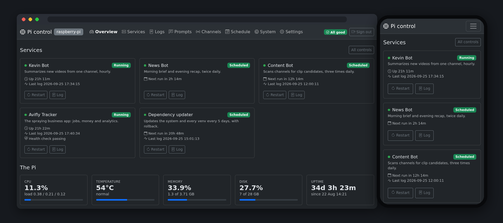

# Pi control

**A control panel for a home server: every background service on one page, with the
buttons to actually run them — and a layout that works from a phone.**

A small machine at home quietly runs a handful of things: a few automation bots, a
business web app, and a job that keeps everything patched. Checking on any of them used
to mean opening a terminal and remembering the right commands. This puts them on one
page — what's running, what failed, what runs next — with the buttons to fix it.

It replaces an earlier version of the same idea that had grown awkward: no login, a
layout that fell apart on a phone, and a design where every new service meant edits in
several files. This rebuild fixed all three.

---

## What it does

**Shows what's actually happening.** Each service gets a card: running or waiting for its
next scheduled run, how long it has been up, how much memory it is using, when it last did
something, and — for the web app — whether it answers a health check. A summary in the
corner says whether anything needs attention.

**Gives you the controls.** Start, stop and restart. Trigger a run by hand — "summarise
now", "send the morning brief" — without waiting for the schedule. Do it to everything at
once, or reboot the machine, from the phone in your pocket.

**Shows the logs.** Pick a service, choose how much to read, filter to the lines you care
about, let it refresh itself while you watch a run happen, and clear it when it gets long.

**Lets you change what the services do.** The wording each bot sends to a language model
is editable in the browser, with the original one click away — and a change that would
quietly break a bot (dropping a placeholder the code fills in) is refused with an
explanation instead of being saved. The same goes for the channels one bot watches and
the addresses another sends to.

**Tells you when something breaks.** A background check compares every service against
what it should be doing and pushes a notification when one fails — and another when it
comes back. Once per failure, not once per check.

**Documents itself.** This page and a private operator's cheat sheet are rendered inside
the app from the project's own Markdown, so the documentation can't drift from the code.

## How it's built

**A modular monolith.** One application, but every feature is a self-contained module
that registers what it adds — menu entries, pages, panels on someone else's page. The
navigation and the home page are assembled from whatever is installed, so a feature can
be switched off without touching the rest.

**Everything it manages is data, not code.** One catalogue entry describes a service: what
it is called, whether it runs constantly or on a schedule, where its log is, what manual
runs it offers, what is editable about it. Its card, log view, controls, schedule row and
editors all follow from that entry. Adding a service is one edit, not eight.

**Least privilege, generated.** The panel runs under its own unprivileged account that
may perform exactly the operations its catalogue describes — a specific list, generated
from that same file, rather than a blanket permission to run commands as an administrator.
It cannot read the credentials belonging to the services it controls. A manual run is
handed to the operating system's service manager rather than executed directly, so it runs
with the right identity and shows up in the system's own records.

**Server-rendered, no build step.** Templates and a stylesheet, with a small library
polling the parts that change (status, figures, a log being tailed) and about forty lines
of hand-written JavaScript. No bundler, no framework, no node_modules. Dark by default
because it is mostly read at night, and laid out for a phone first.

**Tested where it matters.** 56 tests cover the parts that would be embarrassing to get
wrong: which unit a button acts on, that a control refuses anything not in the catalogue,
that a prompt losing a required placeholder is rejected, that a failure is reported once
rather than every five minutes, and that a private document stays private.

## Technology

| Layer | What's used |
|---|---|
| **Language** | Python 3.13 |
| **Framework** | Django 5.2 LTS — templates, auth, ORM, management commands |
| **Front end** | Server-rendered templates with Bootstrap 5.3 and HTMX for live updates. No build step |
| **Storage** | SQLite — the panel holds almost no state of its own: logins and which alerts are open |
| **Service control** | systemd, through a generated allow-list of permitted operations |
| **Notifications** | ntfy for push messages |
| **Quality** | pytest (56 tests), ruff for linting and formatting |
| **Host** | A Raspberry Pi 4, behind a private network |

## Where it goes next

- **Discovering services by itself.** The machine already knows which services were
  installed by hand rather than shipped with the system — enough to offer them as cards to
  adopt, with their name, schedule and logs filled in. The interesting part is doing that
  without widening the permission model, which is why it is a design question and not just
  a feature.
- **Private-network-only access** rather than the local network, so it is reachable from
  anywhere I am without being reachable by anyone else.
